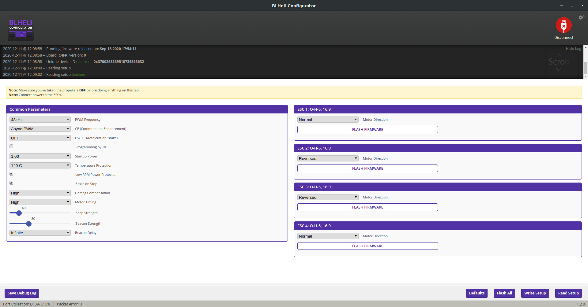

# PATS

## Flashing the Anvil:

1. Start the bf_flash script to flash the firmware and betaflight settings:
```
cd ~/code/pats/config/firmwares/drone
./bf_flash.py -i <ID>
```
This may require to install `pip3 install pyserial` or in case of conda `conda install -c anaconda pyserial`. You'll also need `sudo apt install dfu-util`.
The script supports some command line arguments, like setting the drone id or selecting another settings file, see `./bf_flash.py --help`.

2. Download, unpack and start blheli-m: https://github.com/Asizon/blheli-configurator/releases/tag/1.2.0-jazzmaverick-beta4

3. Flash ESC drivers
Go to the `Flash all` option in BLHeli. Select file manually and go to `pats/config/firmwares/drone`.
Choose the driver file depending on the flightcontroller you are using.
for instance:
Flightcontroller Anvil = O-H-5 16.9
Flightcontroller Hammer CB v2 = S-H-50 16.9
Flightcontroller Hammer CB v2 = F-H-40 16.9

4. For the Anvil, apply the following settings, and then click write all settings:



## Flashing the multimodule:

# NEW (CRAPPY) BOOTLOADER
In case the module never comes out of DFU mode (signified by the red led continously blinking after plugging in usb), the multimodule has the new bootloader with "sticky-DFU". This means we first have to flash the old bootloader:
```
cd ~/code/pats/config/firmwares/multimodule/flash-multi-0.6.0/
./multi-bootreloader -l
```
Then you need to replug the module (5s after the led has died) and flash it once with:
```
./flash-multi -s -f ./multi-stm-6.0.0.20.bin && sleep 1 && (cd .. && ./flash.py
```
From then on you can use old bootloader style flashing.


# OLD (WORKING) BOOTLOADER
```
cd ~/code/pats/config/firmwares/multimodule
./flash.py
```
Same remarks as with drone flash script apply.

## Flashing realsense camera:
`sudo rs-fw-update -f ~/code/pats/config/firmwares/realsense/Signed_Image_UVC_5_12_14_50.bin`

## Flashing Baseboard:

```
$HOME/code/pats/config/firmwares/baseboard/update_baseboard.sh
```

## Initializing new Baseboard:
### Checklist
1. Solder the MP1584EN dc-dc converter
2. Solder the fan connector
3. Solder 5pin connector
4. Flash the cp2105 
5. Program bootloader
6. Init EEPROM

charging only:

7. Place fuse
8. Enable charger
9. Calibrate

Version 1.3 (and up?) only

10. Place jumpers 
11. Cut redundant usb lines
12. Pull down resistor 

### Programming Bootloader
## bb version < 2
$HOME/code/pats/config/firmwares/baseboard/avrdude/avrdude -C$HOME/code/pats/config/firmwares/baseboard/avrdude/avrdude.conf -v -patmega328p -cstk500v2 -Pusb -Uflash:w:$HOME/code/pats/config/firmwares/baseboard/avrdude/optiboot_atmega328.hex:i -Ulock:w:0x0F:m
## bb version >= 2
$HOME/code/pats/config/firmwares/baseboard/avrdude/avrdude -C$HOME/code/pats/config/firmwares/baseboard/avrdude/avrdude.conf -v -patmega328pb -cstk500v2 -Pusb -Uflash:w:$HOME/code/pats/config/firmwares/baseboard/avrdude/optiboot_atmega328.hex:i -Ulock:w:0x0F:m

## bb version 
### Flashing the CP2105 
1. Unpack AN721SW cp2105 costumizer from the baseboard folder (is available for Linux, but works best in Windows)
2. alternatively: https://www.silabs.com/documents/public/example-code/AN721SW.zip
3. Install depencencies "sudo apt install libgtk2.0-0:i386 libxtst6:i386"
4. Make sure you have the udev rules installed or run as root
5. Run CP21xxCustomizationUtility in the Linux/customizer folder
6. Run costumizer as sudo and change "3. SCI/ECI in GPIO Mode" to "0 - SCI/ECI in Modem Mode"
7. Program device

### Flash the baseboard
1. $HOME/code/pats/config/firmwares/baseboard/update_baseboard.sh

### Init EEPROM
1. Type in serial console: "clear config hard"

### Calibrating voltage measurement
1. Connect to charing pad and open in serial monitor (I recommend cutecom)
2. Take a charged drone and measure the voltage on the charging pins
3. Place the drone on the pad
4. Type "enable charger"
5. Type "calib {voltage}" into the serial monitor (for instance "calib 4.23")
6. Serial monitor should now print correct voltage
7. To undo calibration type "reset"

